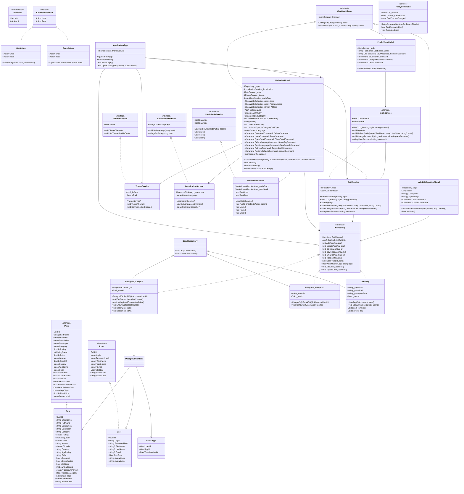

# Class Diagram — AppStore

```mermaid
classDiagram
    %% Core Models
    class IApp {
        <<interface>>
        +Guid Id
        +string ShortName
        +string FullName
        +string Description
        +string Developer
        +string Category
        +double Rating
        +int RatingCount
        +double Price
        +string Version
        +double SizeMB
        +string Country
        +string AgeRating
        +string Color
        +bool IsFeatured
        +bool IsDownloaded
        +bool IsInStock
        +int DownloadCount
        +double? DiscountPercent
        +DateTime ReleaseDate
        +List~string~ Tags
        +double FinalPrice
        +string ButtonLabel
    }

    class App {
        +Guid Id
        +string ShortName
        +string FullName
        +string Description
        +string Developer
        +string Category
        +double Rating
        +int RatingCount
        +double Price
        +string Version
        +double SizeMB
        +string Country
        +string AgeRating
        +string Color
        +bool IsFeatured
        +bool IsDownloaded
        +bool IsInStock
        +int DownloadCount
        +double? DiscountPercent
        +DateTime ReleaseDate
        +List~string~ Tags
        +double FinalPrice
        +string ButtonLabel
    }

    class IUser {
        <<interface>>
        +Guid Id
        +string Login
        +string PasswordHash
        +string? FirstName
        +string? LastName
        +string? Email
        +UserRole Role
        +string AvatarColor
        +string AvatarLetter
    }

    class User {
        +Guid Id
        +string Login
        +string PasswordHash
        +string? FirstName
        +string? LastName
        +string? Email
        +UserRole Role
        +string AvatarColor
        +string AvatarLetter
    }

    class UsersApps {
        +Guid UserId
        +Guid AppId
        +DateTime InstalledAt
    }

    class UserRole {
        <<enumeration>>
        User = 0
        Admin = 1
    }

    IApp <|.. App
    IUser <|.. User

    %% Repository Layer
    class IRepository {
        <<interface>>
        +List~App~ GetAllApps()
        +App? GetAppById(Guid id)
        +void AddApp(App app)
        +void UpdateApp(App app)
        +void DeleteApp(Guid id)
        +void DownloadApp(Guid id)
        +void UninstallApp(Guid id)
        +void RestoreDefaults()
        +List~User~ GetAllUsers()
        +User? GetUserByLogin(string login)
        +void AddUser(User user)
        +void UpdateUser(User user)
    }

    class BaseRepository {
        #List~App~ SeedApps()
        #List~User~ SeedUsers()
    }

    class PostgreSQLRepEF {
        -PostgreDbContext _db
        -Guid _userId
        +PostgreSQLRepEF(Guid currentUserId)
        +void SetCurrentUser(Guid? userId)
        +static string LoadConnectionString()
        -void EnsureDatabaseCreated()
        -void SeedAppsToDb()
        -void SeedUsersToDb()
    }

    class PostgreSQLRepADO {
        -string _connStr
        -Guid _userId
        +PostgreSQLRepADO(Guid currentUserId)
        +void SetCurrentUser(Guid? userId)
    }

    class JsonRep {
        -string _appsPath
        -string _usersPath
        -string _userAppsPath
        -Guid _userId
        +JsonRep(Guid currentUserId)
        +void SetCurrentUser(Guid? userId)
        -void LoadFromFile()
        -void SaveToFile()
    }

    BaseRepository <|-- PostgreSQLRepEF
    BaseRepository <|-- PostgreSQLRepADO
    BaseRepository <|-- JsonRep
    IRepository <|.. PostgreSQLRepEF
    IRepository <|.. PostgreSQLRepADO
    IRepository <|.. JsonRep

    %% Services
    class IAuthService {
        <<interface>>
        +User? CurrentUser
        +bool IsAdmin
        +User? Login(string login, string password)
        +void Logout()
        +void UpdateProfile(string? firstName, string? lastName, string? email)
        +void ChangePassword(string oldPassword, string newPassword)
        +string HashPassword(string password)
    }

    class AuthService {
        -IRepository _repo
        -User? _currentUser
        +AuthService(IRepository repo)
        +User? Login(string login, string password)
        +void Logout()
        +void UpdateProfile(string? firstName, string? lastName, string? email)
        +void ChangePassword(string oldPassword, string newPassword)
        +string HashPassword(string password)
    }

    class IThemeService {
        <<interface>>
        +bool IsDark
        +void ToggleTheme()
        +void SetTheme(bool isDark)
    }

    class ThemeService {
        -bool _isDark
        +ThemeService()
        +bool IsDark
        +void ToggleTheme()
        +void SetTheme(bool isDark)
    }

    class ILocalizationService {
        <<interface>>
        +string CurrentLanguage
        +void SetLanguage(string lang)
        +string GetString(string key)
    }

    class LocalizationService {
        -ResourceDictionary _resources
        +LocalizationService()
        +string CurrentLanguage
        +void SetLanguage(string lang)
        +string GetString(string key)
    }

    class IUndoRedoService {
        <<interface>>
        +bool CanUndo
        +bool CanRedo
        +void Push(IUndoRedoAction action)
        +void Undo()
        +void Redo()
        +void Clear()
    }

    class UndoRedoService {
        -Stack~IUndoRedoAction~ _undoStack
        -Stack~IUndoRedoAction~ _redoStack
        +UndoRedoService()
        +bool CanUndo
        +bool CanRedo
        +void Push(IUndoRedoAction action)
        +void Undo()
        +void Redo()
        +void Clear()
    }

    class IUndoRedoAction {
        <<interface>>
        +Action Undo
        +Action Redo
    }

    class GetAction {
        +Action Undo
        +Action Redo
        +GetAction(Action undo, Action redo)
    }

    class OpenAction {
        +Action Undo
        +Action Redo
        +OpenAction(Action undo, Action redo)
    }

    IAuthService <|.. AuthService
    IThemeService <|.. ThemeService
    ILocalizationService <|.. LocalizationService
    IUndoRedoService <|.. UndoRedoService
    IUndoRedoAction <|.. GetAction
    IUndoRedoAction <|.. OpenAction

    %% ViewModels
    class ViewModelBase {
        <<abstract>>
        +event PropertyChanged
        #OnPropertyChanged(string name)
        #SetField~T~(ref T field, T value, string name) : bool
    }

    class MainViewModel {
        -IRepository _repo
        -ILocalizationService _localization
        -IAuthService _auth
        -IThemeService _theme
        -IUndoRedoService _undoRedo
        +ObservableCollection~App~ Apps
        +ObservableCollection~App~ FeaturedApps
        +ObservableCollection~string~ AllTags
        +App? SelectedApp
        +string SearchQuery
        +string SelectedCategory
        +double MinPrice, MaxPrice, MinRating
        +string SortBy
        +bool DownloadedOnly
        +bool IsDetailOpen, IsCategoryGridOpen
        +string CurrentLanguage
        +ICommand DownloadCommand, DeleteCommand
        +ICommand UndoCommand, RedoCommand
        +ICommand OpenDetailCommand, CloseDetailCommand
        +ICommand SelectCategoryCommand, SelectTagCommand
        +ICommand SwitchLanguageCommand, ClearSearchCommand
        +ICommand RefreshCommand, ToggleSeeAllCommand
        +ICommand RestoreDefaultsCommand, LogoutCommand
        +event LogoutRequested
        +MainViewModel(IRepository, ILocalizationService, IAuthService, IThemeService)
        +void Reload()
        -void RefreshList()
        -IEnumerable~App~ BuildQuery()
    }

    class AddEditAppViewModel {
        -IRepository _repo
        +App Model
        +string[] Categories
        +string[] AgeRatings
        +ICommand SaveCommand
        +ICommand CancelCommand
        +AddEditAppViewModel(IRepository, App? existing)
        +bool Validate()
    }

    class ProfileViewModel {
        -IAuthService _auth
        +string FirstName, LastName, Email
        +string OldPassword, NewPassword, ConfirmPassword
        +ICommand SaveProfileCommand
        +ICommand ChangePasswordCommand
        +ICommand CloseCommand
        +ProfileViewModel(IAuthService)
    }

    ViewModelBase <|-- MainViewModel
    ViewModelBase <|-- AddEditAppViewModel
    ViewModelBase <|-- ProfileViewModel

    %% Commands
    class RelayCommand {
        <<generic>>
        -Action~T~ _execute
        -Func~T,bool~ _canExecute
        +RelayCommand(Action~T~, Func~T,bool~)
        +bool CanExecute(object)
        +void Execute(object)
        +event CanExecuteChanged
    }

    %% Application Bootstrap
    class ApplicationApp {
        -IThemeService _themeService
        +ApplicationApp()
        +static void Main()
        -void ShowLogin()
        -void OpenCatalog(IRepository, IAuthService)
    }

    %% Relationships
    ApplicationApp --> IRepository
    ApplicationApp --> AuthService
    ApplicationApp --> ThemeService
    ApplicationApp --> MainViewModel

    MainViewModel --> IRepository
    MainViewModel --> AuthService
    MainViewModel --> ThemeService
    MainViewModel --> LocalizationService
    MainViewModel --> UndoRedoService

    AuthService --> IRepository
    AuthService --> IAuthService

    AddEditAppViewModel --> IRepository
    ProfileViewModel --> IAuthService

    PostgreSQLRepEF --> PostgreDbContext
    PostgreDbContext --> App
    PostgreDbContext --> User
    PostgreDbContext --> UsersApps
```